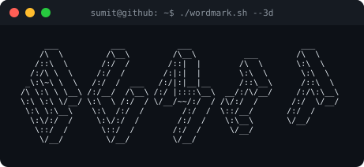

  

<b>sumit@github ~ $ whoami</b>

<table align="center">
  <tr>
    <td></td>
    <td></td>
  </tr>
</table>

<b>sumit@github ~ $ ./contributions.sh</b>

  

<b>sumit@github ~ $ ./about.sh</b>

  A passionate Web Developer, Data Analyst, Data Science and Machine Learning Enthusiast from India 
  🌱 Currently learning <b>Data Science</b> · 📫 sumitkushwaha2411003@gmail.com

<b>sumit@github ~ $ ./links.sh</b>

  
  
  
  
  
  

<h3 align="center">Languages and Tools</h3>

