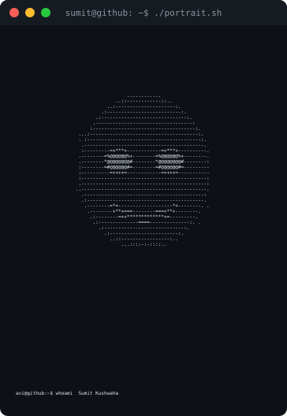

  

<b>sumit@github ~ $ whoami</b>

<table align="center">
  <tr>
    <td></td>
    <td></td>
  </tr>
</table>

<b>sumit@github ~ $ ./contributions.sh</b>

  

<b>sumit@github ~ $ ./links.sh</b>

  Fullstack Developer · Learner

  
  
  

